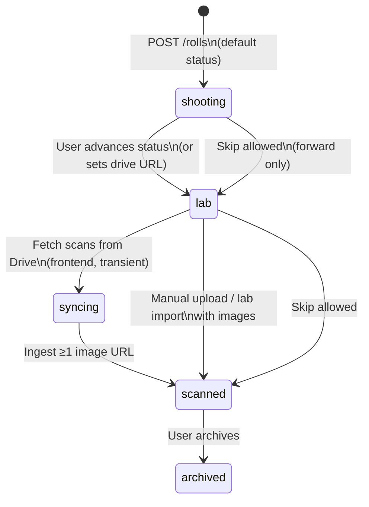

# Roll lifecycle & shot log cycle

How a **roll** moves from creation through shooting, lab, and scans, and how **shots** (technical EXIF logs and scanned frames) are stored, aligned, and displayed.

**Source of truth in code**

| Layer | Primary files |
|-------|----------------|
| Backend roll + shot logic | `backend/app/services/roll_service.py` |
| Shot API | `POST /api/v1/rolls/{id}/shots` in `backend/app/api/v1/rolls.py` |
| Scan ingest (Drive / R2) | `backend/app/api/v1/storage.py` |
| DB models | `backend/app/db/models/roll.py`, `image.py` |
| Frontend roll UI | `frontend/lib/views/roll_detail_view.dart`, `roll_card.dart` |
| Frontend shot logging | `frontend/lib/widgets/exif_capture_modal.dart`, `meter_view.dart` |
| Gallery ↔ shot alignment | `frontend/lib/models/roll_gallery.dart` |

---

## 1. Roll lifecycle (status cycle)

A roll is a single loaded film stock on a camera. Status drives which UI the app shows.



### Status values

| Status | DB (`RollStatusEnum`) | Frontend (`RollStatus`) | Typical UI |
|--------|------------------------|-------------------------|------------|
| Shooting | `shooting` | `shooting` | Shot log actions, roll meta editor |
| At lab | `lab` | `lab` | Drive link, upload scans, partial gallery |
| Syncing | `syncing` | `syncing` | Transient while Drive fetch runs (frontend) |
| Scanned | `scanned` | `scanned` | Full photo grid + shot log |
| Archived | `archived` | `archived` | Read-only gallery |

**Rules**

- New rolls default to **`shooting`** (`rolls.status` server default).
- Backend allows **forward-only** transitions (`loaded` → `shooting` → `lab` → `scanned` → `archived`). Skipping steps is OK; going backward returns `400 invalid_status_transition`.
- After Google Drive ingest, status becomes **`scanned`** only if at least one `images` row has a non-empty `image_url`; otherwise the roll stays **`lab`** (`_finalize_roll_after_drive_ingest`).

### Roll creation (initial state)

**API:** `POST /api/v1/rolls`

| Field | Role |
|-------|------|
| `film_stock_id` | Required — catalog film |
| `user_camera_id` | Optional — locker camera |
| `shot_at_iso` | ISO used when shooting (meter + display) |
| `max_frames` | Capacity (default **36**) |
| `title`, `description` | Shown on roll card / detail |
| `shot_offset` | **0** at creation — alignment calibration |

**Frontend:** `AddRollForm` → `RollsBloc` → repository `createRoll`. Status in the form defaults to `shooting`.

**Initial data:** No `images` rows yet. `frame_count` on dashboard = **0**. User can log shots immediately while status is `shooting`.

---

## 2. Shot model (one table, two roles)

Shots are stored in the **`images`** table (`Image` model). The same row type represents:

1. **Log-only shot** — aperture, shutter, GPS, notes; **`image_url` is null** (logged before scans exist).
2. **Scanned frame** — **`image_url`** set to R2 key or legacy URL; optional EXIF fields; created/updated by Drive sync, ZIP import, or manual upload.

| Column | Log-only | Scanned frame |
|--------|----------|---------------|
| `frame_number` | Monotonic per roll (`max + 1` on each log) | Scan index (0, 1, 2, …) from ingest order |
| `image_url` | `NULL` | Storage key / URL |
| `aperture` | From user / meter | May be filled later from EXIF (future) |
| `shutter_speed` | e.g. `"1/500"` | Same |
| `location_lat`, `location_lng` | From device GPS | Optional |
| `notes` | Meter summary or user text | Optional |
| `created_at` | `logged_at` from client or server `NOW()` | Ingest time |

**Frontend type:** `Shot` (`frontend/lib/models/shot.dart`) mirrors `ImageOut` from the API.

---

## 3. Shot logging flow (shooting phase)

While **`status == shooting`**, users record technical data without a scan file.

### Entry points

| UI | Action | Payload |
|----|--------|---------|
| **Roll card** (Archive / Rolls list) | Camera icon → `ExifCaptureModal` | Aperture slider (iris mimic), shutter slider, GPS |
| **Roll detail** | Same via quick actions when shooting | Same |
| **Light meter** tab | **LOG TO ROLL** → pick a shooting roll | Current meter f/stop, shutter, EV/ISO in `notes`, GPS |

### API

```http
POST /api/v1/rolls/{roll_id}/shots
Authorization: Bearer <firebase>
Content-Type: application/json

{
  "aperture": 2.8,
  "shutter_speed": "1/125",
  "lat": 10.77,
  "lng": 106.69,
  "notes": "optional",
  "logged_at": "2026-05-18T12:00:00.000"   // optional; device local time from app
}
```

**Backend (`log_shot`):**

1. Verify roll belongs to user.
2. `frame_number = max(existing frame_numbers) + 1` (or **0** if first).
3. Insert `Image` with `image_url=None`.
4. Return `ImageOut`.

**Frontend (`RollService.logShot`):** Always sends `logged_at: DateTime.now().toIso8601String()` so log times match the photographer’s device, not the server clock.

After success, providers refresh: `dashboardRollsProvider`, `rollDetailProvider(rollId)`.

---

## 4. Lab → scanned (images attach to the roll)

When the roll moves to **lab** / **scanned**, scans are ingested as **`images`** rows **with** `image_url`.

| Path | Mechanism |
|------|-----------|
| **Google Drive folder** | `drive_url` on roll → sync lists files → upload to R2 → create/update `Image` by `frame_number` |
| **Drive ZIP** | Same pipeline, frames indexed in archive order |
| **Manual picker** | Pro cloud upload / local lab import on device |
| **Local paths API** | `POST /rolls/{id}/local-images` (dev / edge cases) |

Ingest uses **`frame_number = idx`** (0-based scan order). If a row already exists for that frame (e.g. a log-only row at that index), ingest **updates** `image_url` on that row instead of creating a duplicate.

When ingest completes with ≥1 stored URL, roll status → **`scanned`**.

---

## 5. API response shape (`GET /rolls`, `GET /rolls/{id}`)

Dashboard rolls use `RollOutDashboard` (`_build_roll_dashboard`):

| Field | Meaning |
|-------|---------|
| `image_urls` | HTTPS (or signed) URLs for **gallery only** — rows with non-empty `image_url`, ordered by `frame_number`, then **rotated** by `shot_offset` |
| `shots` | **Gallery shots first** (rows with images, same order/rotation as `image_urls`), then **log-only rows** sorted by `frame_number` |
| `frame_count` | `len(image_urls)` after rotation |
| `max_frames` | Roll capacity |
| `shot_offset` | Alignment calibration (0–10 in UI) |

**Important:** Log-only entries are **appended** after gallery rows in `shots`. They are **not** rotated by `shot_offset` on the server. Alignment applies to **scanned** frame order vs. physical film leader frames.

---

## 6. Alignment (`shot_offset`)

**Problem:** Lab scans often include blank **leader** frames at the start. Frame 0 in the ZIP may not be the photographer’s first logged shot.

**Solution:** `rolls.shot_offset` (integer ≥ 0).

**Server:** Rotates `image_urls` (and gallery portion of `shots`):

```text
offset = shot_offset % len(image_urls)
rotated = image_urls[offset:] + image_urls[:offset]
```

**Frontend:** `RollDetailView` → Shot Log tab → **Alignment calibration** slider (0–10). Persists via `PATCH /rolls/{id}/meta` `{ "shot_offset": N }`.

**Display rule (gallery grid / fullscreen):** Gallery index `i` shows metadata from `shotsAligned[i]` (paired URL rows). With offset **2**, the first **visible** scan is treated as the user’s 3rd physical frame on the roll.

```text
If shot_offset = 2:
  shots[0] (first log)  ↔  imageUrls[2]   (after rotation)
```

---

## 7. End-to-end cycle (example)

```text
1. User creates "Portra 400 — M6" roll          → status=shooting, shots=[]
2. On location: logs 3 shots via meter          → 3 rows, image_url=null, frame_number 0,1,2
3. User sets status=lab, adds Drive folder URL
4. Sync downloads 36 JPEGs                      → 36 rows with image_url, frame_number 0..35
   (may merge into existing frame_numbers or create new rows)
5. status=scanned, image_urls populated
6. User opens Shot Log, sets offset=2           → leader frames skipped in gallery alignment
7. User archives roll                           → status=archived
```

---

## 8. UI map by phase

| Phase | Roll card | Roll detail — Photos tab | Roll detail — Shot Log tab |
|-------|-----------|---------------------------|----------------------------|
| **Shooting** | Camera icon (EXIF modal), VIEW LOGS | Meta editor (title, ISO, camera) | Technical list; offset slider hidden until scans exist |
| **Lab** | Drive / sync actions | Import options + partial grid | Logs + alignment when images present |
| **Scanned** | Thumbnail grid | Full grid + EXIF overlay on frames | Full list + alignment slider |
| **Archived** | Same as scanned | Read-only grid | Read-only logs |

---

## 9. Related endpoints

| Method | Path | Purpose |
|--------|------|---------|
| `POST` | `/api/v1/rolls` | Create roll (starts in `shooting`) |
| `PATCH` | `/api/v1/rolls/{id}/status` | Advance lifecycle |
| `PATCH` | `/api/v1/rolls/{id}/meta` | Title, description, **`shot_offset`** |
| `PATCH` | `/api/v1/rolls/{id}/drive-url` | Google Drive folder / ZIP link |
| `POST` | `/api/v1/rolls/{id}/shots` | **Log-only shot** (meter / EXIF modal) |
| `POST` | `/api/v1/rolls/{id}/local-images` | Attach local paths (limited use) |
| Storage routes | `/api/v1/storage/...` | Drive sync, R2 upload, quota |

---

## 10. Verification

Local backend check: `backend/verify_shot_log.py` — creates a roll, logs a shot, asserts `image_url is None` and row appears in dashboard `shots`.
